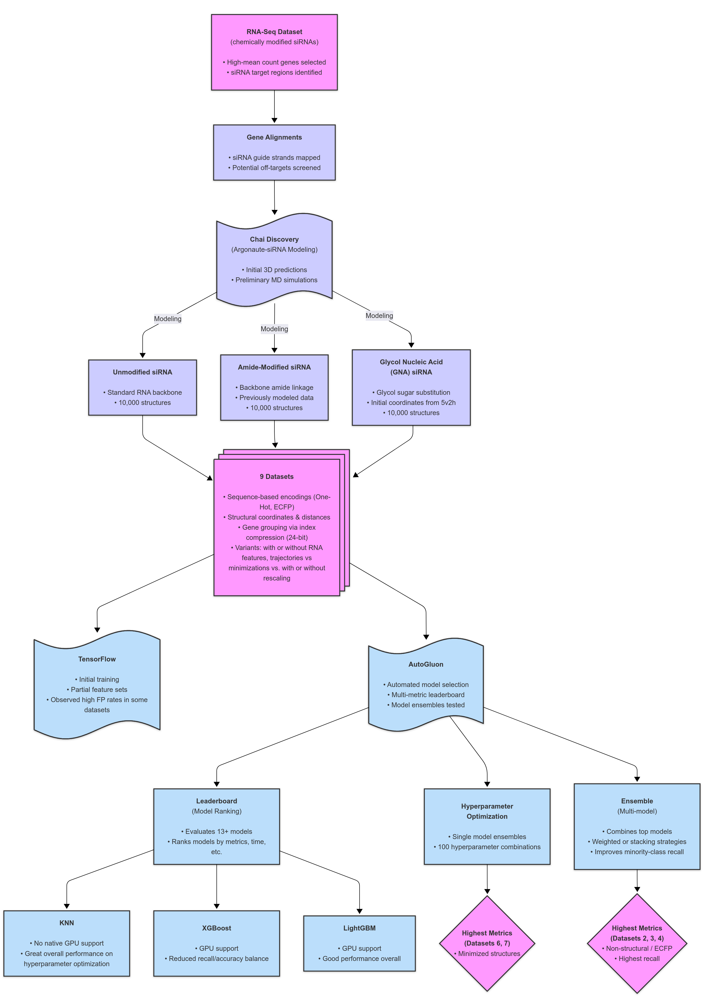
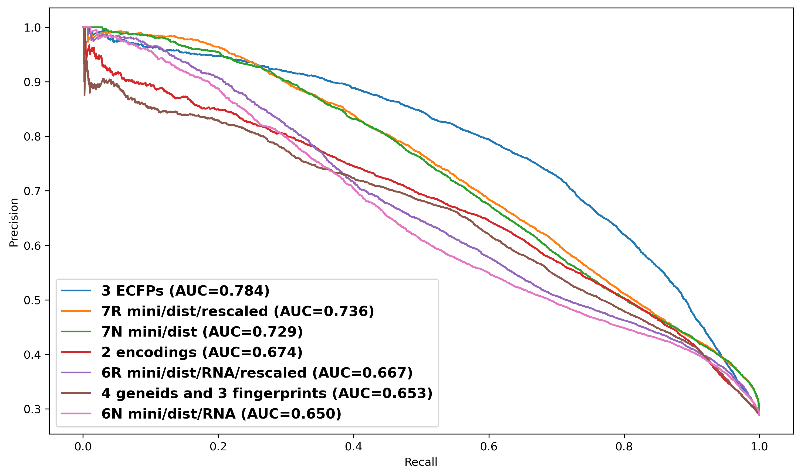

# Live Jetstream notebooks

Last updated: **2026-05-06 11:17 EDT**

The live data and runnable notebooks for this project are hosted on Jetstream at [http://4.bio250293.projects.jetstream-cloud.org/sirna-features/](http://4.bio250293.projects.jetstream-cloud.org/sirna-features/).

On the landing page, enter a dataset id or `G` / `T`:
- `0`, `1`, `2`, `3`, `4`
- `6N`, `6R`, `7N`, `7R`
- `G` for the Gromacs notebook
- `T` for the AutoGluon training notebook

## Direct notebook links

- [Dataset 0 notebook](http://4.bio250293.projects.jetstream-cloud.org/sirna-features/jupyter/notebooks/dataset_0_pipeline.ipynb)
- [Dataset 1 notebook](http://4.bio250293.projects.jetstream-cloud.org/sirna-features/jupyter/notebooks/dataset_1_pipeline.ipynb)
- [Dataset 2 notebook](http://4.bio250293.projects.jetstream-cloud.org/sirna-features/jupyter/notebooks/dataset_2_pipeline.ipynb)
- [Dataset 3 notebook](http://4.bio250293.projects.jetstream-cloud.org/sirna-features/jupyter/notebooks/dataset_3_pipeline.ipynb)
- [Dataset 4 notebook](http://4.bio250293.projects.jetstream-cloud.org/sirna-features/jupyter/notebooks/dataset_4_pipeline.ipynb)
- [Dataset 6/7 notebook](http://4.bio250293.projects.jetstream-cloud.org/sirna-features/jupyter/notebooks/dataset_6_7_pipeline.ipynb)
- [Gromacs notebook](http://4.bio250293.projects.jetstream-cloud.org/sirna-features/jupyter/notebooks/gromacs_pipeline.ipynb)
- [Training notebook](http://4.bio250293.projects.jetstream-cloud.org/sirna-features/jupyter/notebooks/training_pipeline.ipynb)

## Repository layout

This GitHub root now mirrors the lightweight notebook-facing subset of the live Jetstream `sirna-features` directory:

```text
sirna-features/
|-- dataset0/
|-- dataset1/
|-- dataset2/
|-- dataset3/
|-- dataset4/
|-- dataset6_7/
|-- gromacs/
|-- shared_data/
|-- training/
|-- README.md
|-- LICENSE
|-- .gitignore
`-- .github/assets/
```

Large generated data trees with thousands of files are intentionally omitted from GitHub and remain on Jetstream only.

## Table 1

The table below follows manuscript Table 1, with an added live notebook link column.

| Dataset | Description | Key features | Features | Ref. | Live notebook |
| --- | --- | --- | ---: | --- | --- |
| 0 | Distances calculated after modeling siRNA structures with chemical modifications. | Two molecular fingerprints containing dinucleotide at positions 3-4 and a monomer at position 7; distances calculated after trajectories. | 896 | 4f3t | [Dataset 0](http://4.bio250293.projects.jetstream-cloud.org/sirna-features/jupyter/notebooks/dataset_0_pipeline.ipynb) |
| 1 | After modeling, full xyz coordinates of each residue stored as features. | Coordinates of all protein and RNA residues; no fingerprints; trajectories. | 2637 | 4f3t | [Dataset 1](http://4.bio250293.projects.jetstream-cloud.org/sirna-features/jupyter/notebooks/dataset_1_pipeline.ipynb) |
| 2 | Simple RNA encoding of guide strand and predicted target with numerical modification indicators. | Encodings: A = 1, C = 2, G = 3, U = 4, dimer = 5-6, monomer = 7. | 42 | None | [Dataset 2](http://4.bio250293.projects.jetstream-cloud.org/sirna-features/jupyter/notebooks/dataset_2_pipeline.ipynb) |
| 3 | Extended Connectivity Fingerprints (ECFPs) from guide strand and target sequences from alignments. | As Dataset 2, using fingerprints rather than simple numerical encoding. | 1344 | None | [Dataset 3](http://4.bio250293.projects.jetstream-cloud.org/sirna-features/jupyter/notebooks/dataset_3_pipeline.ipynb) |
| 4 | Gene index data used as features; same fingerprints as Dataset 0. | Ensembl IDs as uint8 (gene index 0-2); fingerprints for positions 3-4, 7. | 99 | None | [Dataset 4](http://4.bio250293.projects.jetstream-cloud.org/sirna-features/jupyter/notebooks/dataset_4_pipeline.ipynb) |
| 6N | Distances from minimized structures; pre-modeled structure used as reference. | Distances from pre-modeled base structure; RNA distances included. | 879 | Base | [Dataset 6/7](http://4.bio250293.projects.jetstream-cloud.org/sirna-features/jupyter/notebooks/dataset_6_7_pipeline.ipynb) |
| 6R | As 6N but rescaled (0-255 range normalization). | Rescaled distances for comparability. | 842 | Base | [Dataset 6/7](http://4.bio250293.projects.jetstream-cloud.org/sirna-features/jupyter/notebooks/dataset_6_7_pipeline.ipynb) |
| 7N | Distances from minimized structures; literature reference used. | Distances from the literature reference; no RNA distances. | 837 | 4f3t | [Dataset 6/7](http://4.bio250293.projects.jetstream-cloud.org/sirna-features/jupyter/notebooks/dataset_6_7_pipeline.ipynb) |
| 7R | Same as 7N but rescaled. | Rescaled distances for comparability. | 800 | 4f3t | [Dataset 6/7](http://4.bio250293.projects.jetstream-cloud.org/sirna-features/jupyter/notebooks/dataset_6_7_pipeline.ipynb) |

## Figure 1 workflow

Published Figure 1 from the manuscript:



Live entry points for the workflow:
- [Landing page](http://4.bio250293.projects.jetstream-cloud.org/sirna-features/)
- [Gromacs notebook](http://4.bio250293.projects.jetstream-cloud.org/sirna-features/jupyter/notebooks/gromacs_pipeline.ipynb)
- [Training notebook](http://4.bio250293.projects.jetstream-cloud.org/sirna-features/jupyter/notebooks/training_pipeline.ipynb)

## Figure 6 results

Published Figure 6 from the manuscript:



These values follow Supplementary Table 5, which corresponds to manuscript Figure 6.

| Dataset ID | Seed | PRC AUC | Time (s) | Stack level | Live dataset notebook | Training notebook |
| --- | ---: | ---: | ---: | ---: | --- | --- |
| 3 | 2162 | 0.785 | 370 | 6 | [Dataset 3](http://4.bio250293.projects.jetstream-cloud.org/sirna-features/jupyter/notebooks/dataset_3_pipeline.ipynb) | [Training](http://4.bio250293.projects.jetstream-cloud.org/sirna-features/jupyter/notebooks/training_pipeline.ipynb) |
| 3 | 5836 | 0.783 | 355 | 6 | [Dataset 3](http://4.bio250293.projects.jetstream-cloud.org/sirna-features/jupyter/notebooks/dataset_3_pipeline.ipynb) | [Training](http://4.bio250293.projects.jetstream-cloud.org/sirna-features/jupyter/notebooks/training_pipeline.ipynb) |
| 3 | 5836 | 0.784 | 295 | 5 | [Dataset 3](http://4.bio250293.projects.jetstream-cloud.org/sirna-features/jupyter/notebooks/dataset_3_pipeline.ipynb) | [Training](http://4.bio250293.projects.jetstream-cloud.org/sirna-features/jupyter/notebooks/training_pipeline.ipynb) |
| 7R | 4389 | 0.736 | 780 | 4 | [Dataset 6/7](http://4.bio250293.projects.jetstream-cloud.org/sirna-features/jupyter/notebooks/dataset_6_7_pipeline.ipynb) | [Training](http://4.bio250293.projects.jetstream-cloud.org/sirna-features/jupyter/notebooks/training_pipeline.ipynb) |
| 7N | 7414 | 0.729 | 980 | 4 | [Dataset 6/7](http://4.bio250293.projects.jetstream-cloud.org/sirna-features/jupyter/notebooks/dataset_6_7_pipeline.ipynb) | [Training](http://4.bio250293.projects.jetstream-cloud.org/sirna-features/jupyter/notebooks/training_pipeline.ipynb) |

## Citation

If you use this work, please cite:

```bibtex
@article{richter2025sirnafeatures,
  title={siRNA Features-Automated Machine Learning of 3D Molecular Fingerprints and Structures for Therapeutic Off-Target Data},
  author={Richter, Michael and Admasu, Alem},
  journal={International Journal of Molecular Sciences},
  volume={26},
  number={14},
  pages={6795},
  year={2025},
  doi={10.3390/ijms26146795}
}
```
